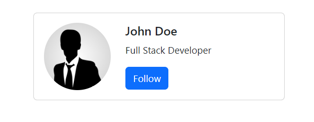

# User Stories for Building a Simple User Profile Card with React-Bootstrap
Working in your `react-bootstrap-template` fulfill the following user stories. For an example of what you'll build, see the user image  

## User Profile Card Display
- **As a user, I want to see a user profile card that includes a profile picture, user name, and a short bio, so that I can quickly get an overview of the user.**

## Profile Picture
- **As a user, I want to see a rounded profile picture on the user profile card, so that the display looks neat and visually appealing.**

## User Name
- **As a user, I want to see the user's name prominently displayed on the profile card, so that I can easily identify the user.**

## Short Bio
- **As a user, I want to read a short bio about the user on the profile card, so that I can learn more about their background or role.**

## Follow Button
- **As a user, I want to see a button labeled "Follow" on the user profile card, so that I can choose to follow the user if I find their profile interesting.**

## Responsive Layout
- **As a user, I want the user profile card to be responsive, so that it looks good and is usable on different screen sizes, including mobile devices.**

# Additional User Stories for the Challenge

## Toggle Follow Button
- **As a user, I want to click the "Follow" button to change its label to "Unfollow", so that I can follow and unfollow the user as needed.**

