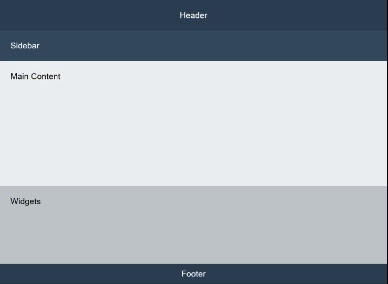

# CSS Flexbox Practice Activity: Build a Responsive Dashboard

This activity will help you practice with CSS Flexbox. Check out the included GIF  to see how the page should behave.

## Objective

Create a responsive dashboard layout using **Flexbox**. The layout should adapt to different screen sizes using Flexbox properties.

## Step 1: Set Up Your Project

1. Inside this folder, you'll see an `index.html` file with some starter code. You will also see an empty `style.css` file.
2. Open both files in your **code editor** (VS Code).
   - **`index.html`** – This contains the starter HTML structure. You do not need to edit this.
   - **`style.css`** – This is blank. Write your CSS here to complete the activity.

---

## Step 2: Style with Flexbox

Use **Flexbox properties** to create a responsive layout. Write your CSS in `style.css`:

**Set up the dashboard layout:**

- Make `.dashboard-container` a **Flexbox container**.
- **Default layout (mobile-first approach):** Stack elements in a column.

**Make the layout responsive:**

- Use `flex-wrap` to allow items to wrap on larger screens.
- Use `flex-grow`, `flex-basis`, and `flex-shrink` to control how items adjust.
- On **larger screens (768px and up)**:
  - The **header and footer** should take up full width.
  - The **sidebar** should take up about **20%** of the space.
  - The **content** should be larger than the **widgets**.

**Hint:** You will need `@media (min-width: 768px)` to adjust the layout for larger screens.

---

## Step 3: Test and Debug

1. Open `index.html` in a browser.
2. Resize the window and observe how elements **adjust dynamically**.
3. **Make sure:**
   - On **small screens**, items are **stacked vertically**.
   - On **larger screens**, items are **arranged in a grid-like layout**.

---

## Step 4: Bonus Challenges

🔥 **Challenge 1:** Use `order` to **rearrange** the widgets to appear **above** the content on **mobile screens**.  
🔥 **Challenge 2:** Apply `align-self` to **change the position of the sidebar** on different screen sizes.  
🔥 **Challenge 3:** Add `gap` between elements for better spacing.
