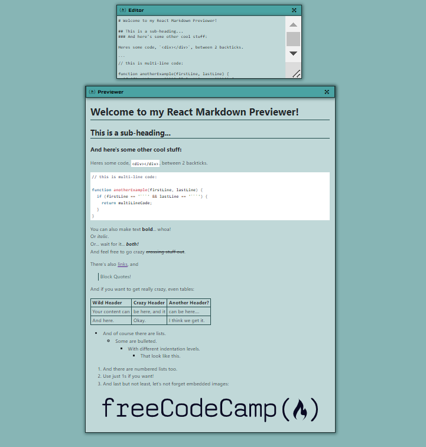

# Markdown Previewer

## Introduction
You will be creating a Markdown previewer made 100% in React. It will preview your markdown (ReadMe) as you write it, which will allow the user to see what they're creating as they create it.

## User Story
```
1. I can see a textarea element with a corresponding id="editor".
2. I can see an element with a corresponding id="preview".
3. When I enter text into the #editor element, the #preview element is updated as I type to display the content of the textarea.
4. When I enter GitHub flavored markdown into the #editor element, the text is rendered as HTML in the #preview element as I type.
5. When my markdown previewer first loads, the default text in the #editor field should contain valid markdown that represents at least one of each of the following elements: a heading element (H1 size), a sub heading element (H2 size), a link, inline code, a code block, a list item, a blockquote, an image, and bolded text.
6. When my markdown previewer first loads, the default markdown in the #editor field should be rendered as HTML in the #preview element.
```
## Example


### Hint
[Dangerously setting the innerHTML](https://react.dev/reference/react-dom/components/common#dangerously-setting-the-inner-html)

### Documentation
We do have access to the markedjs documentation in our classroom. Some snippits from that are included in the `Markedjs Documentation` directory included here. However, if you want to look at the full documentation, you can find it at https://marked.js.org/

## Conclusion

Good luck and happy coding!