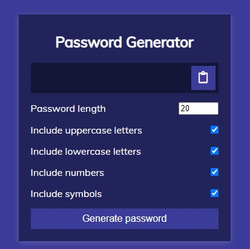
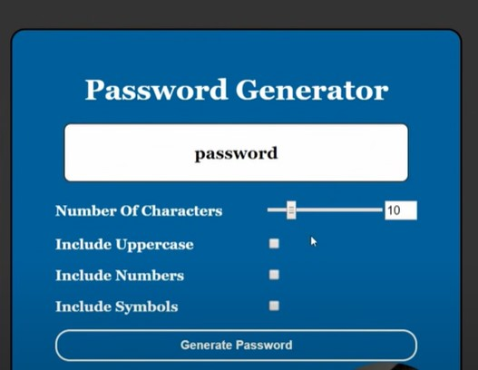
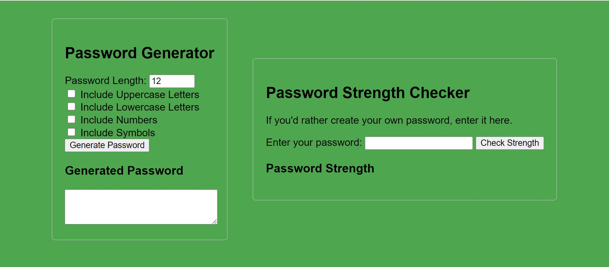

# Project: Password Generator

## Introduction
You will be given this project to create the logic, styling, and skeleton of a password generator. You may have fun with this and create it into something, but need to follow the parameters of the project.

## User Story
```
1. It is done when I have a fully functioning password generator.
2. It is done when I can choose uppercase letters, lowercase letters, numbers, AND/OR symbols for my password.
3. It is done when I can choose between having 8 to 124 characters in my password.
4. It should have the error handling to show that it cannot generate a password without the user choosing at least one character choice.
5. It must have the password appear on the page.
6. You cannot use alert boxes for this.
7. It is done when I can submit my own created password for strength evaluation.
8. It is done when the application informs me whether my submitted password is strong, medium, or weak based on the password strength criteria.
```

## Password Strength Criteria
- **Strong Password**: Includes uppercase letters, lowercase letters, numbers, and symbols, and is at least 12 characters long.
- **Medium Password**: Includes at least three of the following: uppercase letters, lowercase letters, numbers, symbols, and is between 8 to 11 characters long.
- **Weak Password**: Includes less than three of the required elements or is shorter than 8 characters.

## Application Examples





## Acceptance Criteria
- The project will be submitted not later than April 5, 2024 EOD.
- User stories 7 and 8 are optional for extra credit. Their complete implementation will provide an additional 10 extra credit points
