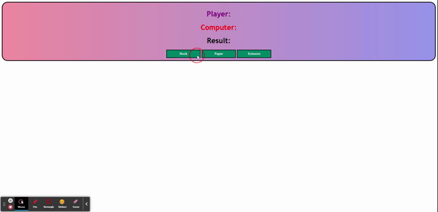

# Rock, Paper, Scissors Project

### Introduction

DOM Manipulation is a huge part of learning JavaScript and how the functionality of JavaScript works. DOM stands for Document Object Model. It is a programming interface that allows us to create, change, and remove elements from a website document. We are using JavaScript to now edit what we have on the page. This is an essential component in learning JavaScript because this is what your future clients and/or employers will want to see when you're in the field. With this rock, paper, scissors game you will be able to utilize all the skills we've taught you thus far, and allow you to display your abilities with the DOM.

### User Story
1. You are to create a rock, paper, scissors game using HTML, CSS, and JavaScript.
2. It is done when you have an HTML page with one div with an id of `gameDiv`.
3. It is done when you have three h1s inside of the div with a class of `gameText`.
4. It is done when each h1 tag has an individual id called `playerText`, `computerText`, and `resultText`.
5. It is done when you have three buttons with the class of `choiceBtn`.
6. It is done when you have a JavaScript file that houses the functionality for the application.
7. Your functionality will include showing the user if they win, lose, or draw.
8. It is done when you have a CSS file that is styled similar to the mock-up gif.
9. You can use your own color scheme.
10. You will not use alert boxes for the results.
11. You will use proper file and folder structure when turning this project in. The JavaScript file should be stored in a `js` directory inside your assets directory.
12. You will include notes within your project to explain your logic.
13. You will include a ReadMe of your project as well.

### Example
This is the example of what your application will look like and how it will function.

### Extra Credit
* Adding pictures and making it your own.
* Adding a feature to collect scores and present them on the page.
* Add a reset button for the game.

### Conclusion

Good luck and have fun with this. Happy Hacking!
