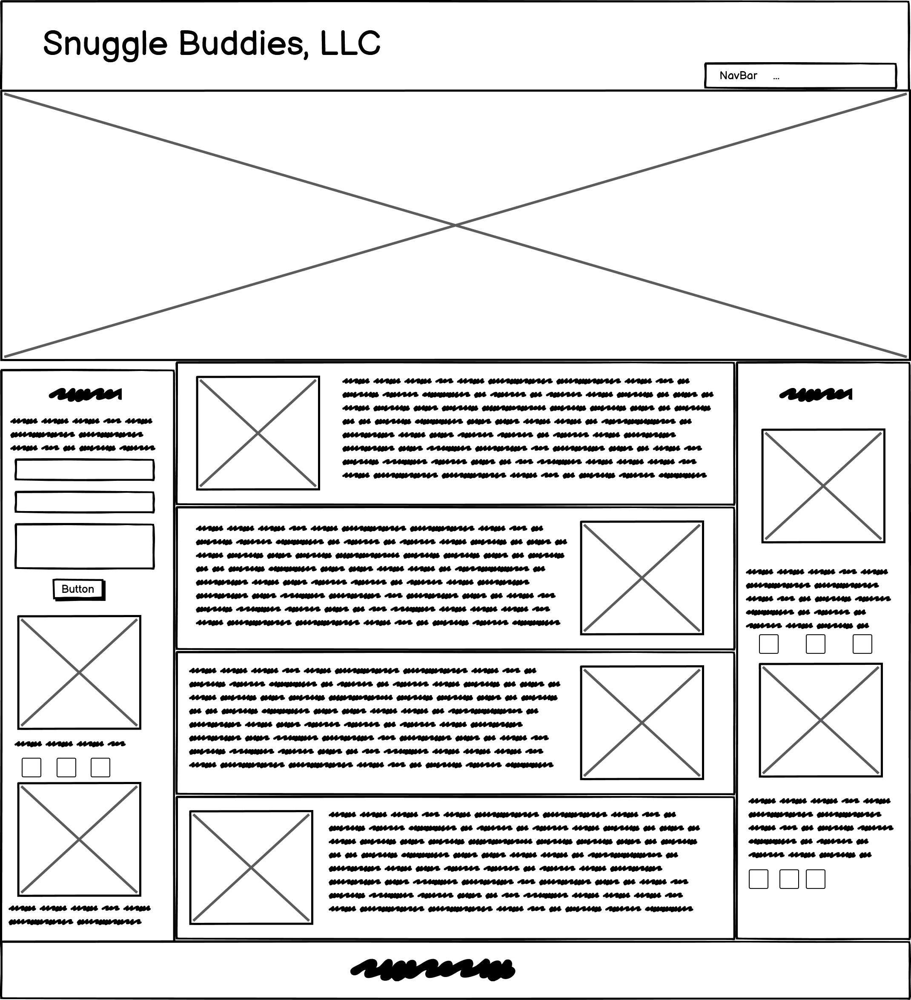

# Responsive Web Design Assessment

## Introduction

### Congratulations!
Some congratulations are in order for all you students who have made it this far. Coding is tough, but you're hanging in there. Now to get on with the assessment!

### Directions
As a person who just opened an adoption clinic, I had an idea with how to build the website. However, the person I initially hired quit after creating a mock-up. I am looking to hire some new developer talent to be able to build the vision I initially had for this. You will be rebuilding the website that you will be provided:


#### User Story
```
1. You will be given an example of a webpage called Snuggle Buddies, LLC to replicate.
2. You will have a wireframe to assist you in understanding the layout.
3. The project is done when you have 5 sections on the webpage consisting of a header, main, footer, and 2 asides.
4. You will have a header that consists of a navbar and large heading image with a logo.
5. The navbar will be fixed to the viewport and have 5 clickable links that take you to different sections of the page: 'Home', 'About Us', 'Our Founder', 'Community', and 'Our Mission'.
6. This navbar will stay at the top of the viewport.
7. One aside will be a contact form that uses input functionality.
8. The aside with the input also has a 'Pet of the Week' section.
9. The input must have some form of validation and is required to have an input field for name, email, and comments.
10. The submit button then links you to https://www.w3schools.com.
11. The social media icons in this section must be linked to an actual website.
12. You can will https://www.facebook.com , https://www.twitter.com , and https://www.linkedin.com .
13. The main (or middle) section will include 'About Us', 'Our Founder', 'Community', and 'Our Mission'.
14. The other aside will have a Testimony section with pictures of pets.
15. Please make sure the Testimony section has the social media links and pictures.
16. You will also have a footer at the bottom.
17. You will be required to make this website accessible for those with certain disabilities.
18. You will also be using the photographs provided.
19. We will also provide the font colors you will be using.
20. You will also be required to use either flexbox or grid for this task.
21. You will also be required to have good folder structure.
```

Please follow the user story as closely as you can and be sure to use your time wisely. The following colors are used for this application:

* #ced9ea
* #ffffff
* #a2bde6
* #e953f1
* #5ba4c3

We have provided a Wireframe and the images needed for the website. You will have an hour to complete this task.



### Extra Credit

The following are some extra credit items that will be offered during this assessment:

```
* Make this responsive
* Use keyframes
* Use media queries
* Create a ReadMe
* Put comments within your code to explain your logic
```

## Conclusion

You will be given the full day to accomplish this task. Please make sure that you give it your all. You will be able to use your resources, such as w3schools, notes, and your book for this. However, you __WILL NOT__ use your neighbor or talk during this process. If something is unclear to you, you will be able to ask your Instructional Staff for assistance, however, we cannot help you by giving answers or finding solutions. Good luck!

### Extra!
These are the codes for the emoticons used at the header and the footer:

```
* &#128062;
* &#128008;
* &#128021;
```