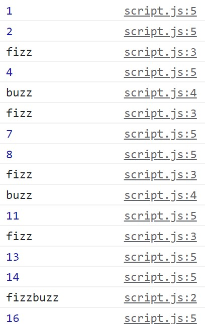

## Getting started
This assessment is comprised of four coding tasks and three long-answer questions.

In this director, create an `index.html` file and a `script.js` document. Make sure the two are connected. Complete the following coding tasks in your `script.js` and log your results to the browser console. Be sure to include notes in your code to indicate which question your code answers.

Complete the long-answer questions at the bottom of this `Instructions.md` document.

## Coding tasks (3 points each)
1) Todd has travelled a lot. Below is an object of the the transportation he has used. Referencing the object below, write code that will log the McDonnell-Douglass DC-10 to the console.
```js
    const person = {
      name:"Todd",
      age:27,
      vehicles: {
         car:"toyota",
         bike:"ktm-duke",
         hired: {
          app: 'Lyft',
          taxi: 'Black Cab',
          public: 'Bus'
         },
         airlines:{
            lufthansa: {
              planes: ['Airbus A350', 'Boeing 767', 'Boeing 737'], 
            },
             "British airways": {
              planes: ['Airbus A330', 'McDonnell-Douglass DC-10', 'Boeing 777']
             }
         }
      }
   } 
```

2) Write a function to convert miles to kilometers (hint: the formula is miles * 1.609)

3) Copy the function declaration below into your `script.js` file. In your `script.js` file call the function so that the number 10 is logged to your console. **DO NOT** alter the function declaration.
```js
   function doMath (num) {
    return (num + 15) / 3;
}
```

4) Log the numbers 1 to 100 to your console. Except on all multiples of three log "Fizz" to the console in place of the number. On all multiples of 5 log "Buzz" to the console in place of the number. On all multiples of 3 and 5 log "fizzbuzz" to the console in place of the number. For a sample of what your console should look like, see the example picture. 

## Long answer questions (1 point each)
1) What is the basic syntax of a `ternary operator?`

2) If a function does not have a return statement, what will it return?

3) What is the difference between a `while loop` and a `do... while` loop?